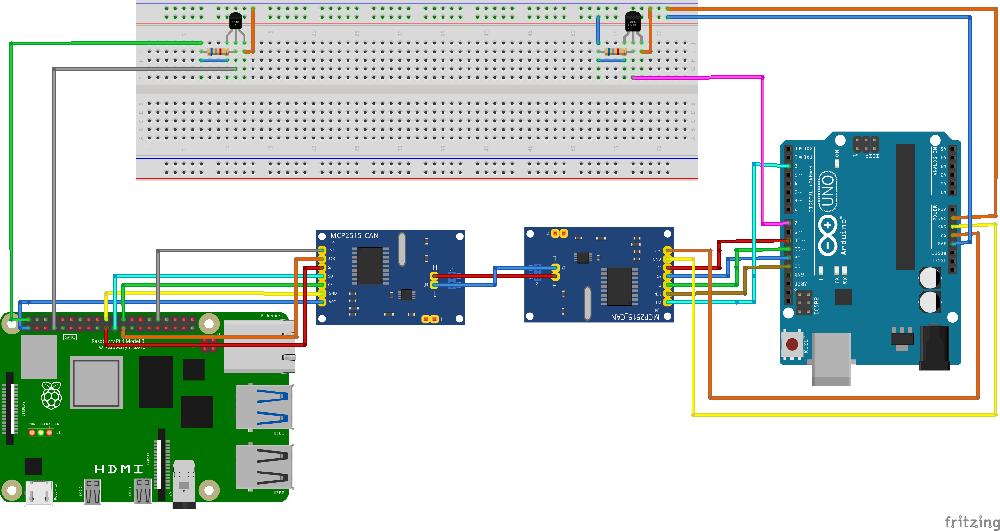

# CAN Bus with DHT11 and DS18B20 with Arduino and Raspberry Pi

## Description
The project involves gathering temperature and humidity data using a DHT11 sensor connected to an Arduino UNO. This data is then transmitted over a CAN bus. At the receiving end of the CAN bus, a Raspberry Pi processes the data and publishes it using the MQTT protocol, with the broker setup on cloud in [MQTTHQ](https://mqtthq.com). Additionally, the Raspberry Pi also collects data from the temperature sensor DS18B20.

## Background
This project is a part of a group project lab of the course Applied Network and Bus Technology for Automation and Control, in Rheinland-Pfälzische Technische Universität (RPTU) Kaiserslautern. The main goal is to demonstrate the ability to use different kinds of Bus Technologies. In this project there are three bus communication protocols used:
* DHT11 communication protocol with the Arduino.
* CAN Bus between the Arduino and Raspberry Pi GPIO.
* One wire protocol from the sensor DS18B20 to the Raspberry Pi GPIO.

## Diagram

## Transceiving Side

The wiring from MCP2515 to Arduino UNO:
| MCP2515 Pin | Arduino Pin |
|-------------|-------------|
| VCC         | 5V          |
| GND         | GND         |
| CS          | D10         |
| SO          | D12         |
| SI          | D11         |
| SCK         | D13         |
| INT         | D2          |

DHT11 Sensor is connected to Pin 8.

## Receiving Side

The wiring in Raspberry Pi:
| PIN  | SIGNAL NAME       | MODULE SIGNAL  |
|------|-------------------|----------------|
| \#07 | GPIO4 (GPCLK0)    | DATA - DS18B20 |
| \#19 | GPIO10 (MOSI)     | SI             |
| \#20 | GND               | GND            |
| \#21 | GPIO 9 (MISO)     | SO             |
| \#23 | GPIO11 (SCLK)     | SCK/CLK        |
| \#24 | GPIO8 (CE0)       | CS             |
| \#32 | GPIO12            | INT            |

## Dependencies

* Arduino MCP2515 library from [https://github.com/coryjfowler/MCP_CAN_lib](https://github.com/coryjfowler/MCP_CAN_lib).
* Installed in Raspberry Pi:
    * paho-mqtt
    * python-can 
    * for [configuration of MCP2515](https://forums.raspberrypi.com/viewtopic.php?t=141052) -> baudrate set to 500kbps.
    * for [configuration of DS18B20](https://www.circuitbasics.com/raspberry-pi-ds18b20-temperature-sensor-tutorial/).

## MQTT Client
The data published can be accessed from [https://mqtthq.com/client](https://mqtthq.com/client) with subscribing to the topic 'sensor/temperature'.